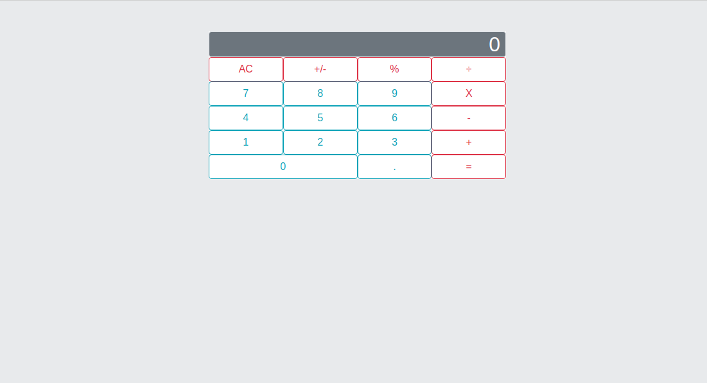

# Math Magicians Calculator

Math Magicians Calculator is the first project from the React and Redux module from Microvers. The goal is to create a basic calculator for a fictional company based in France, Math Magicians, to help them with their calculations.  

##  :hammer: Built with:

- Html
- Bootstrap
- JavaScript
- React

##  :red_circle: Live Demo:

[Live demo](https://math-magic-calculator0106.herokuapp.com/)

##  :construction_worker: Getting Started

To get a local copy up and running follow these simple steps:

- Go to the main page.
- Clone it using git command "git clone git@github.com:ricardomonte/math-magicians-calculator.git".
- Open in terminal the folder just cloned.
- run in terminal 'npm install'.
- To see locally run 'npm run start'.

## :bust_in_silhouette: Author

- Github: [@ricardomonte](https://github.com/ricardomonte)
- Twitter: [@ramnkco](https://twitter.com/ramnkco)
- LinkedIn: [Ricardo Montenegro](https://www.linkedin.com/in/ricantomontenegro/)

## :raised_hand: :raised_hand: Contributions

Contributions, issues and feature requests are welcome!

Feel free to check the [issues here](https://github.com/ricardomonte/math-magicians-calculator/issues).

## Show your support

Give a :star: if you like this project!.

##  :grey_exclamation: Acknowlegment

- To [Microverse](https://www.microverse.org/)
- Mentor.
- Stand up team

##  :memo: License

This project is [MIT](LICENSE) licensed.